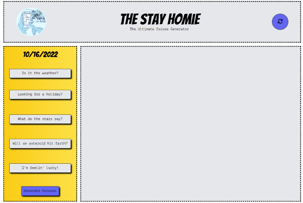

# The Stay Homie
A responsive, interactive application that allows users to generate excuses to stay home from work by leveraging information from third party APIs.

## User Story
As a burnt out cog in this wheel of capitalism

I want to generate excuses 

So that I can get out of a work day without thinking

## Description
The Stay Homie is a tongue-in-cheek, get-out-of-work excuse generator.

This project provides a laugh in addition to a slew of up-to-date, and clever reasons to keep you from going into work on days when you're just not ‘feeling it’.

In addition to providing humor, this project allowed for solidifying our foundational skills when working with, and fetching API’s, JavaScript functionality, and using Tailwind to style.

## Usage
Our application is accessible via a web browser.

Upon reaching the landing page, you will notice an assemblage of buttons labeled with the style of excuse they provide. Pick the buttons that cater to your excuse needs–one to all–then hit submit to see the provided excuses. Note: two of the buttons will prompt you for additional information to give you a more accurate response. 

Upon hitting submit, you will see your generated excuses, as mentioned, and additionally provided with a form you can fill out to generate a personalized email you can send to you boss. 

## Future Implementation
This application allows for endless creative additions. A next phase could be suggested activities for your day-off.

## Links
Repository: https:/github.com/cornetj13/stay-homie
Deployed site: https:/cornetj13.github.io/stay-homie/

## Credits 
Website designed and built by:
Jonathan Cornet, github.com/cornetj13
Jordan Johnson, github.com/jordan-koichiro-johnson
Devon Durst, github.com/d-dursty

This website was built using Tailwind, CSS, JavaScript, and HTML

## License 
We used an MIT License. Please reference the repository for additional information. 
